# Workflows

## 1. Load Readings

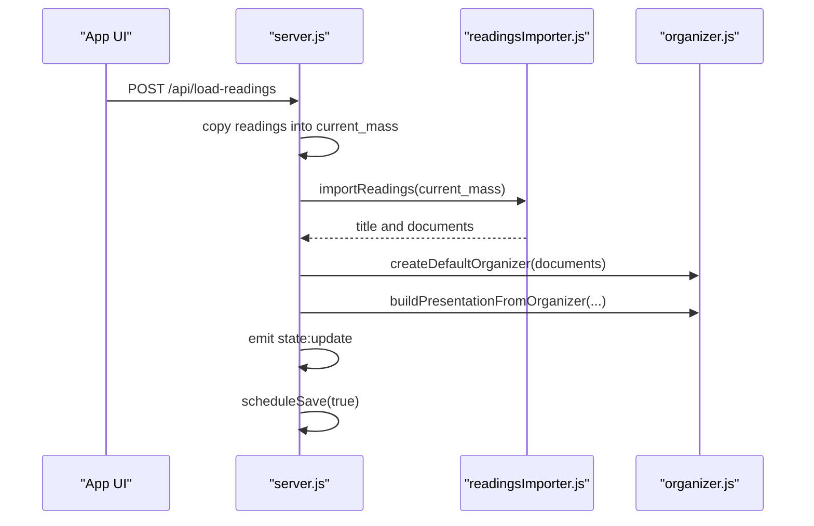

## 2. Update Organizer

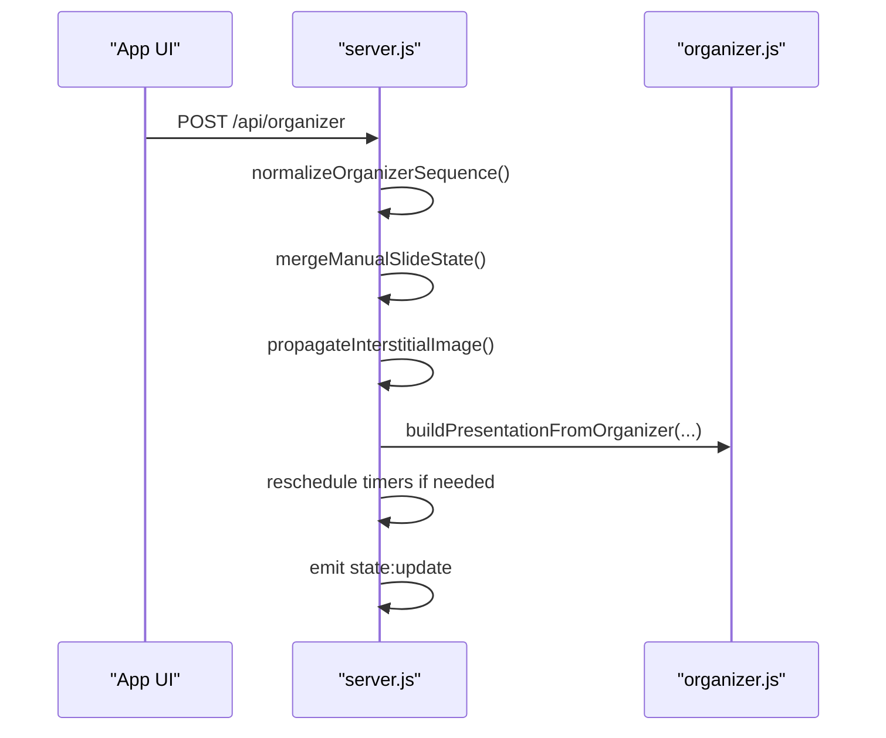

## 3. Countdown Handling

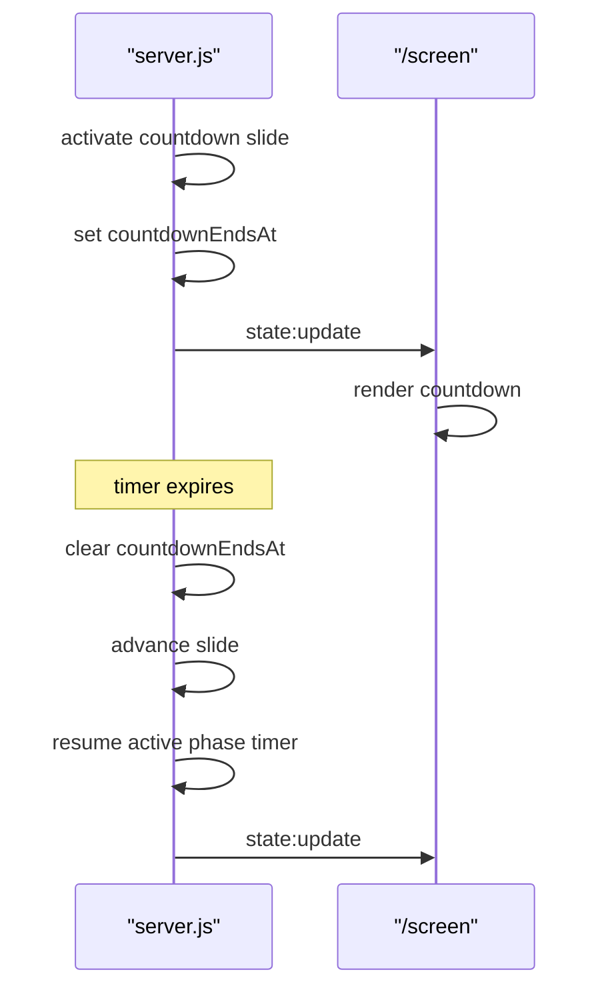

## 4. Remote Interstitial Hold

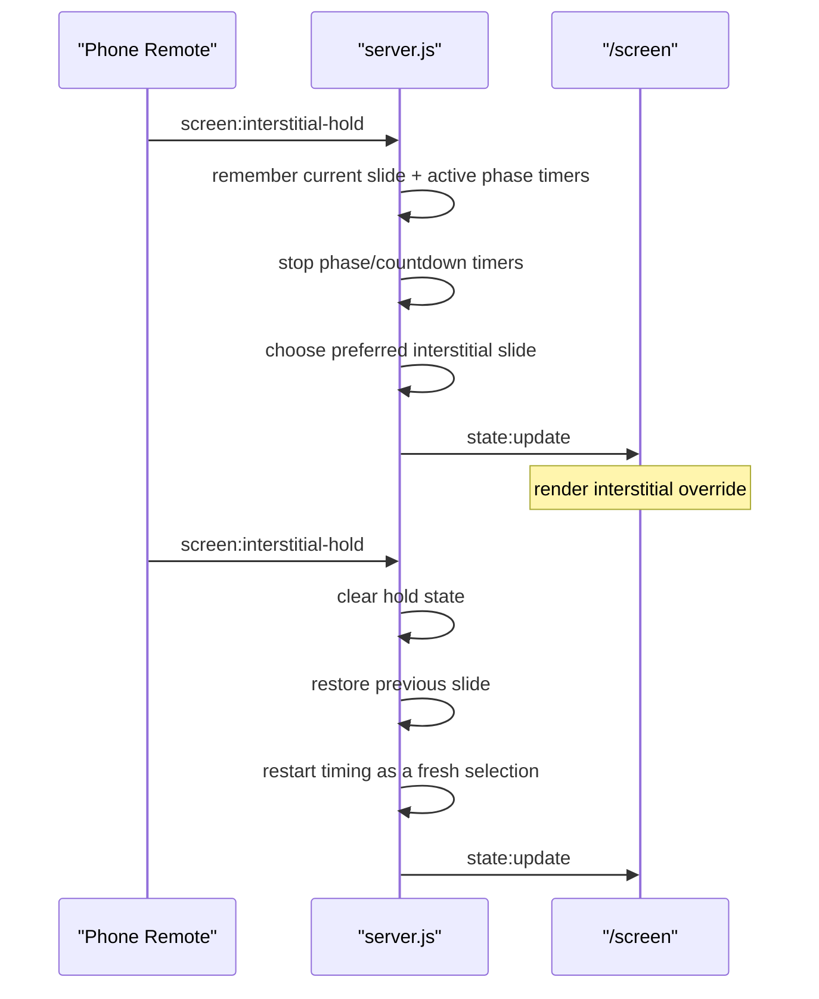

## 5. PIN-Gated Start

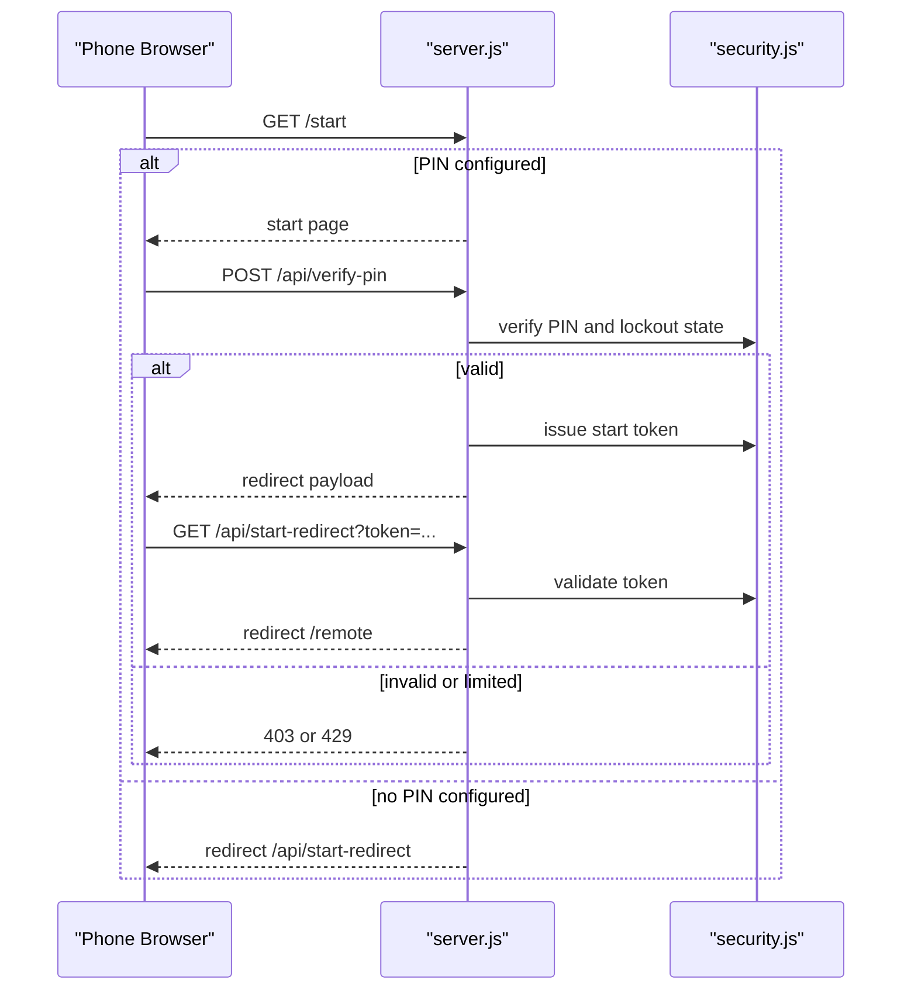

## 6. Mass Asset Upload and Refresh

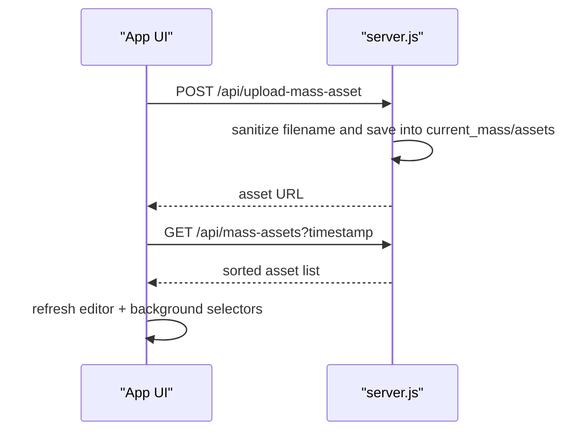

## 7. ZIP Import

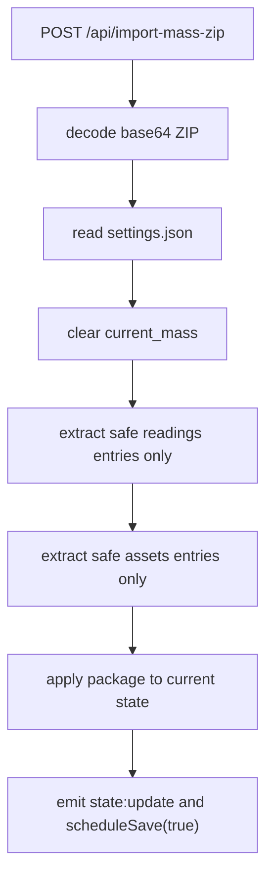

Unsafe nested or traversal-style ZIP entry paths are ignored.

## 8. ZIP Export

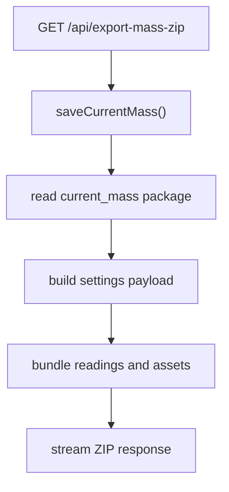

## 9. AVIF Export

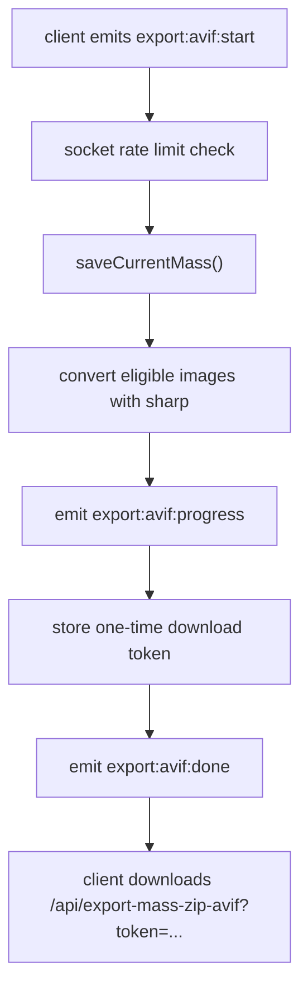

## 10. Archive Compression

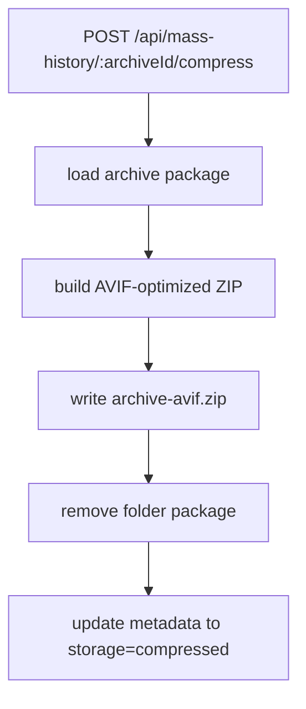

## 11. Session Restore

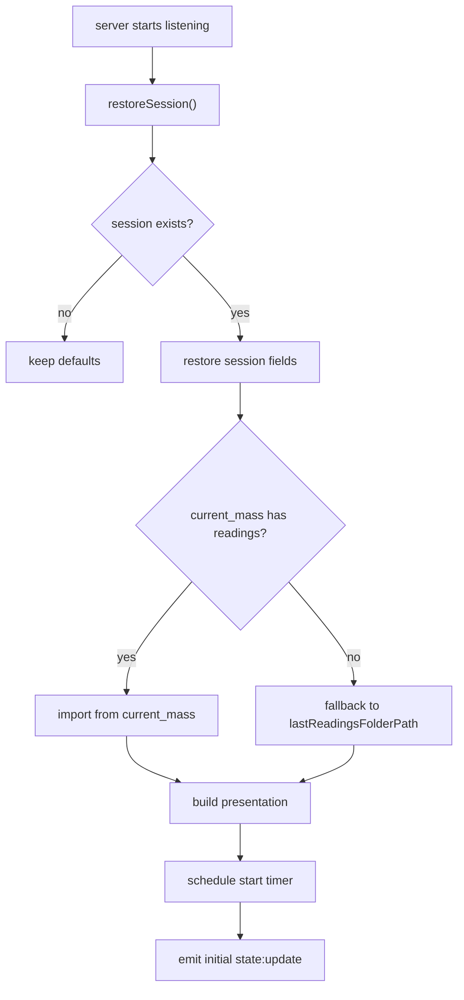
